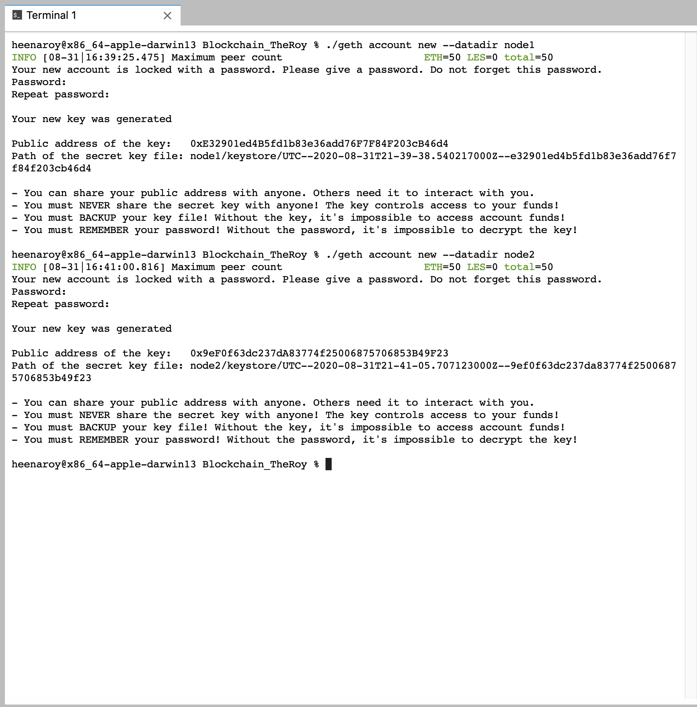
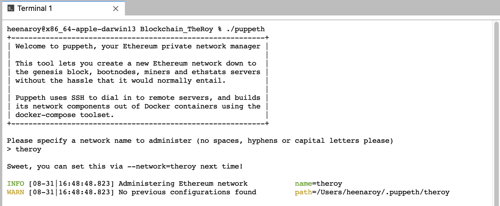

# TheRoy Blockchain

This Homework assignment required we build a blockchain using Proof of Authority (Clique), however after repeated attempts at both Proof of Authority (Clique) and Proof of Work (Ethash), I was not able to mine the data for further processing.

In light of homework deadlines, I am submitting the work done thus far:

## Step 1: Create Nodes on the Network

I used Go Ethereum Tools to create my own blockchain (https://geth.ethereum.org/downloads/). I only created 2 nodes. Additional nodes can be created as needed using the same methodology.

Using Terminal, we navigate to the blockchain tools directory and run the following commands:

>```./geth account new --datadir node1```

>```./geth account new --datadir node2```

    You will be required to enter a password, do not lose this password!
    
    You will be given a Public address of the key and a Path of the secret key file. Save these!!
    


## Step 2: Generate the Genesis Block (Proof of Authority)

In the blockchain tools directory, run the following command:

>```./puppeth```

    You will be required to name your network.
    


    Next you will create the Genesis Block using Clique (Proof of Authority). You will need your saved Public Addresses for both Seal and Pre-Fund.

")

    We will not be using the -aleth.json, -harmony.json, and -parity.json files.
    

## Step 3: Initialize the Nodes (Proof of Authority)

Next, run the following command:

>```./geth init theroy.json --datadir node1```

>```./geth init theroy.json --datadir node2```


")


## Step 4: Activate the Miner Node (Proof of Authority)

We will activate the miner on Node 1 with this command:

>```./geth --datadir node1 --mine --minerthreads 1```

 - ERROR")

    As you can see I had a fatal error starting protocol stack. 

### Re-Run Steps 2 through 4 using Proof of Work (Ethash)

I re-ran the Genesis, Initialization, and Mining using Proof of Work (Ethash), but got the same error in the end. You will notice Publice Addresses are different as Nodes were re-generated.

## Step 2: Generate the Genesis Block (Proof of Work)

In the blockchain tools directory, run the following command:

>```./puppeth```

    You will be required to name your network.
    


    Next you will create the Genesis Block using Ethash (Proof of Work). You will need your saved Public Addresses for Pre-Fund.

")

    We will not be using the -aleth.json, -harmony.json, and -parity.json files.
    

## Step 3: Initialize the Nodes (Proof of Work)

Next, run the following command:

>```./geth init theroy.json --datadir node1```

>```./geth init theroy.json --datadir node2```


")


## Step 4: Activate the Miner Node (Proof of Work)

We will activate the miner on Node 1 with this command:

>```./geth --datadir node1 --mine --minerthreads 1```

 - ERROR")

    As you can see I have a fatal error starting protocol stack. 